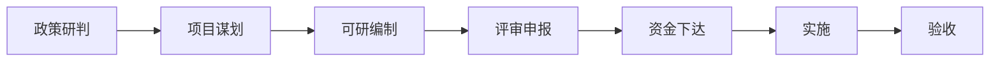

# 文旅策划报告模板库

> 10+种结构化策划方案模板，覆盖主流文旅项目类型。
> 使用时填充方括号 `[ ]` 中的内容，删除不需要的章节。

---

## 模板1：景区提升规划方案

```
# [景区名称] 提升规划方案

## 1. 项目背景
### 1.1 项目概况
- 项目名称：[ ]
- 项目地点：[省/市/县]
- 规划面积：[ ] km² / 亩
- 现状等级：[ ]A级景区 / 非A级

### 1.2 规划期限
- 近期：[20XX-20XX，2-3年]
- 中期：[20XX-20XX，3-5年]
- 远期：[20XX-20XX，5-10年]

### 1.3 提升必要性
- 硬件老化程度
- 产品竞争力下降情况
- 游客满意度现状
- 市场竞争压力

## 2. 现状诊断
### 2.1 硬件评估
- 游客中心：[现状描述]
- 停车场：[车位数量/管理现状]
- 游步道：[总长度/完好率]
- 厕所：[数量和等级]
- 导览系统：[现状评估]

### 2.2 软件评估
- 管理水平：[ ]
- 服务质量：[ ]
- 智慧化程度：[ ]
- 安全应急：[ ]

### 2.3 SWOT分析
[优势/劣势/机会/威胁]

## 3. 提升策略
### 3.1 硬件提升清单
| 项目 | 现状 | 提升方案 | 投资估算 | 优先级 |
|------|------|---------|---------|-------|
| 游客中心 | [ ] | [ ] | [ ]万 | [高/中/低] |
| 停车场 | [ ] | [ ] | [ ]万 | [ ] |
| ... | [ ] | [ ] | [ ]万 | [ ] |

### 3.2 产品提升
- 新增产品：[ ]
- 改造产品：[ ]
- 淘汰产品：[ ]

### 3.3 品牌与营销提升
- 品牌定位：[ ]
- 营销策略：[ ]

## 4. 投资估算
- 硬件提升：[ ]万元
- 产品开发：[ ]万元
- 营销推广：[ ]万元
- 预备金(10%): [ ]万元
- **合计：[ ]万元**

## 5. 效益预测
- 提升后预计年客流：[ ]万人次（提升[ ]%）
- 提升后人均消费：[ ]元（提升[ ]%）
- 预计年收入：[ ]万元
- 回收期：[ ]年
```

---

## 模板2：乡村振兴旅游策划方案

```
# [乡镇/村庄名称] 农文旅融合发展规划

## 1. 村情概况
- 行政村名：[ ]
- 所属县市：[ ]
- 户籍人口：[ ]人，常住人口：[ ]人
- 耕地面积：[ ]亩，林地面积：[ ]亩
- 村集体经济收入：[ ]万元
- 距最近高速口：[ ]km，距高铁站：[ ]km
- 自然/人文资源特色：[摘要描述]

## 2. 政策机遇
[分析项目与乡村振兴/文旅融合/美丽乡村等政策的契合度]

## 3. 资源评估
### 3.1 农业资源
- 主导产业：[ ]
- 特色农产品：[ ]
- 可体验资源：[采摘/农耕/加工]

### 3.2 自然生态
- 山水资源：[ ]
- 植被覆盖：[ ]
- 负氧离子/空气质量：[ ]

### 3.3 文化资源
- 历史故事/传说：[ ]
- 非遗项目：[ ]
- 传统建筑：[ ]
- 民俗活动：[ ]

## 4. 主题定位
- 核心定位：[一句话描述]
- 差异化亮点：[ ]
- 品牌Slogan：[ ]

## 5. 产业规划
### 5.1 农业+旅游
- 观光农业：[ ]
- 采摘体验：[ ]
- 农事研学：[ ]

### 5.2 民宿+文创
- 民宿规划：[ ]间，定位[经济/精品/高端]
- 文创产品：[ ]

### 5.3 餐饮+体验
- 乡土餐饮：[ ]
- 体验手作：[ ]

## 6. 带动机制
- 就业带动：[ ]人
- 农户增收：[ ]元/户/年
- 村集体增收：[ ]万元/年
- 返乡创业平台：[ ]

## 7. 实施路径
- 第一阶段（1-3个月）：[基础设施完善]
- 第二阶段（3-6个月）：[首批业态落地]
- 第三阶段（6-12个月）：[全面运营推广]

## 8. 投资估算
- 政府配套：[ ]万元
- 社会资本：[ ]万元
- 村民自筹：[ ]万元
- **合计：[ ]万元**
```

---

## 模板3：度假区项目策划方案

```
# [项目名称] 度假区策划方案

## 一、项目概况
- 项目名称：[ ]
- 项目地点：[ ]
- 规划面积：[ ]亩/平方公里
- 项目定位：[综合度假/康养度假/亲子度假/主题度假]
- 总投资：[ ]亿元
- 分期开发：[ ]期

## 二、市场分析
### 2.1 客源地分析
- 一级客源市场（1h交通圈）：[ ]万人
- 二级客源市场（2h交通圈）：[ ]万人
- 三级客源市场（3h交通圈）：[ ]万人

### 2.2 目标客群
| 客群类型 | 占比 | 核心需求 | 人均消费 |
|---------|------|---------|---------|
| 亲子家庭 | [ ]% | [ ] | [ ]元 |
| 情侣/朋友 | [ ]% | [ ] | [ ]元 |
| 银发康养 | [ ]% | [ ] | [ ]元 |
| 企业团建 | [ ]% | [ ] | [ ]元 |

### 2.3 竞品分析
| 竞品名称 | 距离 | 体量 | 特色 | 可借鉴/规避 |
|---------|------|------|------|------------|
| [ ] | [ ]km | [ ]亩 | [ ] | [ ] |
| [ ] | [ ]km | [ ]亩 | [ ] | [ ] |

## 三、总体规划
### 3.1 主题定位
- 核心概念：[ ]
- 品牌Slogan：[ ]
- IP故事线：[ ]

### 3.2 功能分区
| 分区名称 | 面积占比 | 核心功能 | 主要业态 |
|---------|---------|---------|---------|
| [ ] | [ ]% | [ ] | [ ] |
| [ ] | [ ]% | [ ] | [ ] |
| [ ] | [ ]% | [ ] | [ ] |
| [ ] | [ ]% | [ ] | [ ] |

### 3.3 动线规划
- 一日游动线：[ ]
- 两日游动线：[ ]
- 三日游动线：[ ]

## 四、产品体系
### 4.1 核心产品
1. [产品名称] — [功能介绍] — [定价]
2. [产品名称] — [功能介绍] — [定价]

### 4.2 住宿体系
| 产品类型 | 数量 | 价格区间 | 特色 |
|---------|------|---------|------|
| 精品民宿 | [ ]间 | [ ]元 | [ ] |
| 度假酒店 | [ ]间 | [ ]元 | [ ] |
| 露营地 | [ ]个 | [ ]元 | [ ] |

### 4.3 夜经济方案
- 夜景：[ ]
- 夜演：[ ]
- 夜游：[ ]
- 夜市：[ ]
- 夜宿：[ ]

## 五、运营模式
- 运营主体：[自营/合作/委托运营]
- 盈利模式：[门票+二消+住宿+招商]
- 淡旺季策略：[ ]

## 六、投资财务
### 6.1 投资估算
| 项目 | 金额（万元） |
|------|-------------|
| 土地整理 | [ ] |
| 建安工程 | [ ] |
| 景观工程 | [ ] |
| 设备采购 | [ ] |
| 预备金(10%) | [ ] |
| **合计** | **[ ]** |

### 6.2 收益预测
- 预计年客流：[ ]万人（首年）/ [ ]万人（成熟期）
- 综合人均消费：[ ]元
- 年收入：[ ]万元
- 年运营成本：[ ]万元（收入的[ ]%）
- 年净利润：[ ]万元
- 静态回收期：[ ]年
```

---

## 模板4：研学基地策划方案

```
# [基地名称] 研学实践教育基地策划方案

## 1. 项目概述
- 基地名称：[ ]
- 依托资源：[自然生态/历史文化/科技/农业/工业]
- 可接待容量：[ ]人/日
- 计划建设面积：[ ]亩/㎡

## 2. 课程体系
### 2.1 主题分类
| 主题板块 | 适用学段 | 课程门数 | 关联学科 |
|---------|---------|---------|---------|
| [ ] | [小学/初中/高中] | [ ]门 | [ ] |
| [ ] | [ ] | [ ]门 | [ ] |
| [ ] | [ ] | [ ]门 | [ ] |

### 2.2 示范课程（每主题1-2门）
**课程1：[课程名称]**
- 适用学段：[ ]
- 课程时长：[ ]分钟
- 教学目标：[ ]
- 活动流程：
  1. [导入/讲解 15min]
  2. [体验/实践 30min]
  3. [总结/分享 15min]
- 所需物料：[ ]
- 安全要点：[ ]

### 2.3 课程组合推荐
- 一日研学：[ ]课程组合
- 两日研学：[ ]课程组合
- 主题夏令营：[ ]课程组合

## 3. 场地规划
| 功能区域 | 面积 | 可容纳 | 用途 |
|---------|------|-------|------|
| 室内教室 | [ ]㎡ | [ ]人 | [ ] |
| 户外场地 | [ ]㎡ | [ ]人 | [ ] |
| 手工工坊 | [ ]㎡ | [ ]人 | [ ] |
| 餐厅 | [ ]㎡ | [ ]人 | [ ] |
| 宿舍 | [ ]㎡ | [ ]个床位 | [ ] |

## 4. 运营方案
- 收费标准：[ ]元/人/天（含[ ]）
- 接待能力：[ ]人/日
- 师资配置：[ ]位导师 / [ ]位教官 / [ ]位助教
- 安全预案：[ ]
- 保险方案：[ ]

## 5. 申报资质
- 需申报的资质：[中小学生研学实践教育基地/科普教育基地等]
- 申报条件对标：[ ]
- 预计批复时间：[ ]

## 6. 投资预算
| 项目 | 金额（万元） |
|------|-------------|
| 场地改造 | [ ] |
| 教学设备 | [ ] |
| 课程开发 | [ ] |
| 师资培训 | [ ] |
| **合计** | **[ ]** |
```

---

## 模板5：商业计划书（文旅项目）

```
# [项目名称] 商业计划书

## 执行摘要
[300-500字概括项目核心亮点、市场规模、投资需求、预期回报]

## 1. 项目概述
- 项目名称：[ ]
- 项目定义：[一句话定义]
- 核心亮点：[3-5个关键点]

## 2. 市场机会
- 市场规模：[ ]亿元
- 增长率：[ ]%
- 目标人群：[ ]人
- 市场痛点：[ ]

## 3. 产品与服务
- 核心产品：[ ]
- 辅助产品：[ ]
- 定价策略：[ ]
- 竞争优势：[ ]

## 4. 商业模式
- 收入来源：[门票/餐饮/住宿/二销/招商/其他]
- 收入占比预测：[ ]
- 盈利模型：[ ]

## 5. 团队介绍
- 核心团队：[ ]
- 顾问团队：[ ]
- 已有人才优势：[ ]

## 6. 财务预测
| 项目 | 第1年 | 第2年 | 第3年 |
|------|-------|-------|-------|
| 投资额 | [ ]万 | [ ]万 | [ ]万 |
| 预计收入 | [ ]万 | [ ]万 | [ ]万 |
| 预计净利润 | [ ]万 | [ ]万 | [ ]万 |

## 7. 融资需求
- 融资金额：[ ]万元
- 出让股权：[ ]%
- 资金用途：[建设/运营/营销/补流]
- 投资回报：[预计[ ]年回本，[ ]年实现[ ]倍回报]
```

---

## 模板6：可行性研究报告大纲

```
# [项目名称] 可行性研究报告

## 第1章 总论
1.1 项目概况
1.2 编制依据
1.3 主要经济技术指标
1.4 研究结论与建议

## 第2章 项目背景与发展概况
2.1 项目提出的背景
2.2 投资方基本情况
2.3 项目前期工作

## 第3章 市场分析与预测
3.1 宏观环境分析（PEST）
3.2 区域旅游市场分析
3.3 目标客群分析
3.4 竞争格局分析
3.5 市场预测

## 第4章 建设条件与选址
4.1 选址方案
4.2 自然条件
4.3 基础设施条件
4.4 选址合理性分析

## 第5章 建设方案
5.1 总体规划构思
5.2 功能分区
5.3 建设内容与规模
5.4 技术方案
5.5 公用工程

## 第6章 环境保护与安全
6.1 环境现状
6.2 环境影响分析
6.3 环境保护措施
6.4 安全与消防

## 第7章 投资估算与资金筹措
7.1 投资估算编制依据
7.2 投资估算表
7.3 资金筹措方案

## 第8章 财务评价
8.1 财务评价基础数据
8.2 收入预测
8.3 成本费用估算
8.4 盈利能力分析
8.5 敏感性分析

## 第9章 社会效益与风险分析
9.1 社会效益评价
9.2 风险识别与评估
9.3 风险防控措施

## 第10章 结论与建议
10.1 可行性结论
10.2 建议
```

---

## 模板7：A级景区创建方案

```
# [景区名称] [ X ]A级景区创建实施方案

## 1. 创建目标
- 拟创等级：[ 5A / 4A / 3A ]
- 创建时限：[ ]年
- 对标标准：[GB/T 17775标准]

## 2. 现状评估（对标评分表）
| 评价项目 | 标准分 | 现状得分 | 差距 | 提升计划 |
|---------|-------|---------|------|---------|
| 旅游交通 | [ ]分 | [ ]分 | [ ]分 | [ ] |
| 游览服务 | [ ]分 | [ ]分 | [ ]分 | [ ] |
| 旅游安全 | [ ]分 | [ ]分 | [ ]分 | [ ] |
| 卫生 | [ ]分 | [ ]分 | [ ]分 | [ ] |
| 邮电服务 | [ ]分 | [ ]分 | [ ]分 | [ ] |
| 旅游购物 | [ ]分 | [ ]分 | [ ]分 | [ ] |
| 综合管理 | [ ]分 | [ ]分 | [ ]分 | [ ] |
| 资源和环保 | [ ]分 | [ ]分 | [ ]分 | [ ] |
| **总分** | **[ ]分** | **[ ]分** | **[ ]分** | **—** |

## 3. 重点提升工程
### 3.1 硬件提升（[ ]项）
[清单略]

### 3.2 软件提升（[ ]项）
[清单略]

### 3.3 申报材料准备清单
[ ]

## 4. 创建时间表
[甘特图或表格]

## 5. 投资预算
- 硬件提升：[ ]万元
- 软件提升：[ ]万元
- 申报费用：[ ]万元
- **合计：[ ]万元**

## 6. 创建效益
- 品牌价值提升预测
- 客流量提升预测
- 政府补贴/奖励额度
```

---

## 模板8：夜经济项目策划

```
# [项目名称] 夜间经济打造方案

## 1. 项目背景
- 现有日间产品：[ ]
- 夜间经济空白：[ ]
- 市场需求依据：[ ]

## 2. 夜经济五件套

### 2.1 🌃 夜景视觉
- 核心夜景IP：[灯光秀/光影装置/夜光步道]
- 设计风格：[ ]
- 最佳观赏点：[ ]

### 2.2 🎭 夜间演艺
- 核心演出：[ ]（[ ]分钟/场）
- 小型演绎：[街头艺人/快闪/巡游]
- 互动环节：[ ]

### 2.3 🍢 夜市美食
- 业态配比：餐饮60% + 文创20% + 游戏20%
- 特色美食：[ ]
- 摊位数量：[ ]个
- 管理模式：[统一管理/自营+招商]

### 2.4 🏡 夜宿
- ��宿产品：[民宿/露营/酒店]
- 星空观测点：[ ]
- 夜宿体验：[ ]

### 2.5 🚣 夜游（可选）
- 游船/步道夜游
- 夜间导览

## 3. 投资估算
| 项目 | 估算投资 | 预期月收入 |
|------|---------|-----------|
| 灯光系统 | [ ]万 | [ ]万 |
| 演艺 | [ ]万 | [ ]万 |
| 夜市 | [ ]万 | [ ]万 |
| 其他 | [ ]万 | [ ]万 |
| **合计** | **[ ]万** | **[ ]万** |

## 4. 运营方案
- 营业时间：[18:00-24:00]
- 人员配置：[ ]人
- 安全管理：[ ]
- 投诉处理：[ ]
```

---

## 模板9：康养度假项目策划

```
# [项目名称] 康养度假策划方案

## 1. 项目定位
- 康养类型：[森林康养/温泉康养/中医康养/田园康养]
- 目标客群：[45-70岁高净值人群]
- 核心卖点：[ ]

## 2. 康养资源评估
- 空气负氧离子：[ ]个/cm³
- 年平均气温：[ ]℃
- 植被覆盖率：[ ]%
- 水质/温泉： [ ]
- 中医药文化：[ ]

## 3. 产品体系
### 3.1 康养核心产品
| 产品类型 | 内容 | 定价 | 频次 |
|---------|------|------|------|
| 体检评估 | [ ] | [ ]元 | 1次/入住 |
| 康养疗程 | [ ] | [ ]元 | 1次/天 |
| 养生课程 | [ ] | [ ]元 | 1次/天 |
| 药膳食疗 | [ ] | [ ]元 | 3餐/天 |

### 3.2 休闲配套
- 运动健身：[太极/瑜伽/八段锦/徒步]
- 文化体验：[茶道/香道/书法/阅读]
- 社交活动：[讲座/手作/音乐会]

## 4. 套餐设计
| 套餐 | 天数 | 内容 | 价格 |
|------|------|------|------|
| 3天2夜养生体验 | 3天 | [ ] | [ ]元 |
| 7天6夜深度疗愈 | 7天 | [ ] | [ ]元 |
| 14天亚健康调理 | 14天 | [ ] | [ ]元 |

## 5. 硬件配套
- 康养中心：[ ]㎡
- 住宿：[ ]间（含无障碍设施）
- 医疗配套：[诊所/合作医院]
- 户外空间：[ ]㎡

## 6. 投资与收益
- 总投资：[ ]万元
- 床位：[$]张
- 年均入住率：[ ]%
- 年均收入：[ ]万元
- 回收期：[ ]年
```

---

## 模板10：工业旅游改造方案

```
# [企业名称] 工业旅游改造策划方案

## 1. 企业概况
- 企业名称：[ ]
- 主营业务：[ ]
- 工厂面积：[ ]㎡
- 年接待能力：[ ]人
- 核心价值观：[ ]

## 2. 工业旅游价值分析
- 品牌溢价：[ ]
- 消费者信任：[ ]
- 第二增长曲线：[ ]
- 政府支持：[ ]

## 3. 参观动线设计
### 3.1 标准动线
入口→[展厅]→[生产线透明参观]→[体验区]→[文创商店]→出口
（全程约[ ]分钟）

### 3.2 特色节点
| 节点 | 停留时间 | 体验内容 | 互动设计 |
|------|---------|---------|---------|
| [ ] | [ ]min | [ ] | [ ] |
| [ ] | [ ]min | [ ] | [ ] |

## 4. 体验产品设计
- 参观体验：[免费/收费] — [ ]元/人
- DIY体验：[ ] — [ ]元/人
- 亲子活动：[ ] — [ ]元/组
- 研学课程：[ ] — [ ]元/人

## 5. 配套设施
- 游客中心：[ ]㎡
- 停车场：[ ]个车位
- 卫生间：[ ]个
- 休息区：[ ]㎡

## 6. 投资预算
| 项目 | 金额（万元） |
|------|-------------|
| 参观通道改造 | [ ] |
| 展陈设计 | [ ] |
| 体验区建设 | [ ] |
| 配套设施 | [ ] |
| **合计** | **[ ]** |

## 7. 效益预测
- 年接待游客：[ ]万人
- 门票+体验收入：[ ]万元
- 产品现场销售增长：[ ]%
- 品牌价值提升：[ ]
```

---

## 模板11（V2.0 新增）：商业模式设计方案

```markdown
# [项目名称] 商业模式设计方案

## 1. 商业模式类型选择

| 类型 | 适用条件 | 核心逻辑 | 盈利方式 |
|------|---------|---------|---------|
| 内容驱动型 | 有独特文化IP/故事资源 | 内容创造流量，流量变现 | 授权费+体验票+衍生品 |
| 场景驱动型 | 有不可复制的自然/建筑场景 | 场景创造消费冲动 | 场景体验票+社交传播 |
| 生态驱动型 | 多方资源（政府+企业+村民） | 平台分润，共生共赢 | 分润+管理费+资源整合 |

**本方案选择的模式：** [内容驱动/场景驱动/生态驱动/组合型]

## 2. 5层收入结构模型

```
第5层: 被动收入（品牌授权/IP输出/管理输出/数据资产）
第4层: 延伸收入（文创/课程/内容付费/社群会员）
第3层: 增值收入（特色餐饮/住宿升级/深度体验/定制服务）
第2层: 基础收入（门票/停车/基础餐饮/基础住宿）
第1层: 流量收入（广告/冠名/补贴/招商）
```

### 收入结构预测表

| 层级 | 收入类型 | 预计年收入(万) | 占比 | 毛利率 |
|------|---------|--------------|------|-------|
| 第5层 被动收入 | [品牌授权/管理输出] | [ ] | [ ]% | 80-95% |
| 第4层 延伸收入 | [文创/课程/社群] | [ ] | [ ]% | 60-80% |
| 第3层 增值收入 | [特色餐饮/升级服务] | [ ] | [ ]% | 50-70% |
| 第2层 基础收入 | [门票/停车/基础消费] | [ ] | [ ]% | 40-60% |
| 第1层 流量收入 | [广告/补贴/招商] | [ ] | [ ]% | 60-90% |
| **合计** | | **[ ]** | **100%** | — |

**健康度检查：** 门票收入占比[ ]%(应<30%) ✓/✗ 综合消费占比[ ]%(应>50%) ✓/✗

## 3. 全生命周期盈利策略

### 冷启动期（0-1年）
- 目标：验证市场需求，轻资产试水
- 策略：[政府项目/合作运营/众筹/低起量]
- 核心指标：[月客流>X人/满意度>X%/复购率>X%]
- 投资预算：[ ]万元（控制在总投资[ ]%以内）

### 增长期（1-3年）
- 目标：扩大流量，提升客单价，建立会员体系
- 策略：[新媒体推广/渠道合作/产品迭代/定价优化]
- 核心指标：[年客流增长X%/客单价提升至X元/会员数X人]

### 成熟期（3年+）
- 目标：品牌输出，IP授权，数字资产变现
- 策略：[品牌加盟/管理输出/数字内容/资源整合]
- 核心指标：[授权收入X万/加盟店X家/数字产品覆盖X人]

## 4. 盈利模型验证

| 验证维度 | 检查项 | 通过条件 | 当前判断 |
|---------|-------|---------|---------|
| 流量获取 | 年客流能否支撑收入目标？ | 客源地人口 > 目标客流×10 | [可行/风险] |
| 用户停留 | 停留时间是否足够产生消费？ | 核心消费场景停留≥3h | [可行/风险] |
| 消费转化 | 客单价是否覆盖运营成本？ | 人均 > (年运营成本÷年客流) | [可行/风险] |
| 复购传播 | 是否有激励复购/传播的机制？ | 会员体系+社交分享激励 | [可行/风险] |
```

---

## 模板12（V2.0 新增）：沉浸式文旅与情绪价值设计方案

```markdown
# [项目名称] 沉浸式文旅·情绪价值设计方案

## 1. 文旅3.0进化阶段定位

当前项目处于：[ 1.0卖资源 / 2.0卖体验 / 3.0卖情绪 ]

**目标阶段：** [1.0→2.0跃升 / 2.0→3.0跃�� / 直接从3.0起步]

## 2. 情绪赛道选择

| 赛道 | 规模 | 项目契合度 | 评分 |
|------|------|-----------|------|
| 释放/解压 | 60亿人次情绪需求 | ⭐⭐⭐⭐⭐ | [ ]分 |
| 疗愈/治愈 | 康养万亿市场 | ⭐⭐⭐⭐ | [ ]分 |
| 共鸣/认同 | 文化自信心需求 | ⭐⭐⭐ | [ ]分 |
| 惊喜/新奇 | 年轻客群偏好 | ⭐⭐⭐⭐ | [ ]分 |
| 归属/连接 | 社群经济兴起 | ⭐⭐⭐ | [ ]分 |
| 仪式/纪念 | 纪念日经济 | ⭐⭐⭐⭐ | [ ]分 |

**核心赛道聚焦：** [选择1-2个]

## 3. 五感沉浸设计矩阵

| 感官 | 设计要素 | 具体方案 | 预估投资 |
|------|---------|---------|---------|
| 👁️ 视觉 | 景观美学/光影/色彩 | [灯光秀/景观造型/色彩体系] | [ ]万 |
| 👂 听觉 | 自然声景/音乐/白噪音 | [背景音乐/鸟鸣/水声系统] | [ ]万 |
| 👃 嗅觉 | 花草香/食物香/文化气味 | [香薰系统/花草种植] | [ ]万 |
| 👅 味觉 | 地方美食/手作 | [特色餐饮/体验工坊] | [ ]万 |
| ✋ 触觉 | 材质/温度/互动 | [自然材质/交互装置] | [ ]万 |

## 4. 场景营造四步法实施

### Step1: 确定情绪主题
- 情绪关键词：[ ]（如：宁静、治愈、惊喜、归属）
- 主题Slogan：[ ]
- 故事背景：[简要描述]

### Step2: 设计五感触点
- 入口触点：[ ]（第一印象，5秒内传递情绪）
- 途中触点：[ ]（持续强化情绪）
- 高潮触点：[ ]（情绪顶峰，震撼/感动）
- 收尾触点：[ ]（情绪余韵，引发回念）

### Step3: 构建叙事线索
- 游客角色：[探险者/治愈者/学者/体验者]
- 故事主线：[ ]
- 剧情节点：[节点1→节点2→节点3→高潮→结局]

### Step4: 设置仪式节点
| 节点 | 仪式动作 | 产出 | 社交传播值 |
|------|---------|------|-----------|
| 入口仪式 | [敲钟/系祈福带] | 仪式感 | 中 |
| 核心体验 | [手印/签名/体验证书] | 纪念凭证 | 高 |
| 结束仪式 | [纪念品/合影/留言] | 社交素材 | 极高 |

## 5. 沉浸式产品设计

| 产品类型 | 内容 | 时长 | 定价 | 日接待量 |
|---------|------|------|------|---------|
| 沉浸式演艺 | [实景剧/光影秀] | [ ]min | [ ]元 | [ ]人 |
| 沉浸式夜游 | [夜光步道/游船] | [ ]min | [ ]元 | [ ]人 |
| 沉浸式研学 | [自然课堂/非遗工坊] | [ ]min | [ ]元 | [ ]人 |
| 沉浸式消费空间 | [主题餐饮/文创市集] | — | 人均[ ]元 | [ ]人 |
```

---

## 模板13（V2.0 新增）：政策资金申报方案

```markdown
# [项目名称] 政策资金申报方案

## 1. 政策资金匹配分析

| 资金通道 | 规模 | 匹配条件 | 项目符合度 | 优先级 |
|---------|------|---------|-----------|-------|
| 乡村振兴补助 | 1062亿(2026) | 涉及乡村振兴 | [高/中/低] | [A/B/C] |
| 现代农业产业园 | 7000万-1亿/个 | 农业产业规模 | [高/中/低] | [A/B/C] |
| 产业强镇 | 500-3000万/个 | 乡镇主导产业 | [高/中/低] | [A/B/C] |
| 地方专项债 | 4.4万亿 | 收益覆盖≥1.3倍 | [高/中/低] | [A/B/C] |
| 超长期特别国债 | 1.3万亿 | 国家级重大项目 | [高/中/低] | [A/B/C] |
| 省级旅游专项资金 | 各地不同 | 文旅项目 | [高/中/低] | [A/B/C] |

## 2. 申报关键流程



**当前阶段：** [政策研判/项目谋划/可研编制/评审申报/实施中/待验收]

## 3. 申报时序表

| 时间窗口 | 任务 | 责任人 | 进度 |
|---------|------|-------|------|
| 1-2月 | 政策研判（一号文件） | [ ] | [ ] |
| 3-4月 | 赛马攻坚，材料准备 | [ ] | [ ] |
| 5-6月 | 专项债高峰申报 | [ ] | [ ] |
| 7-8月 | 特别国债冲刺 | [ ] | [ ] |
| 9-10月 | 次年项目储备 | [ ] | [ ] |
| 11-12月 | 收尾复盘 | [ ] | [ ] |

## 4. 资金计划

| 渠道 | 申报金额 | 预计获批 | 资金用途 |
|------|---------|---------|---------|
| [中央财政] | [ ]万 | [ ]万 | [ ] |
| [省级配套] | [ ]万 | [ ]万 | [ ] |
| [地方配套] | [ ]万 | [ ]万 | [ ] |
| [社会资本] | [ ]万 | [ ]万 | [ ] |
| [自筹资金] | [ ]万 | — | [ ] |
| **合计** | **[ ]万** | **[ ]万** | — |

## 5. 六大红线禁区自查

- [ ] 是否涉及耕地保护红线？
- [ ] 是否涉及生态保护红线？
- [ ] 债务风险覆盖率是否≥1.3倍？
- [ ] 是否在政策负面清单内？
- [ ] 收益预测是否虚高（虚假收益）？
- [ ] 是否使用集体建设用地（合规否）？

> ⚠️ 以上6项有任何一项「是」，需先解决合规问题再申报。
```

---

## 模板14（V2.0 新增）：土地合规检查清单

```markdown
# [项目名称] 土地合规检查报告

## 1. 红线地带检查（三条不可触碰）

| 红线类型 | 项目是否涉及 | 面积(亩) | 合规建议 |
|---------|------------|---------|---------|
| 永久基本农田 | [是/否/待查] | [ ] | ❌不可用于文旅建设，必须避让 |
| 生态保护红线 | [是/否/待查] | [ ] | ❌禁止开发性建设 |
| 城镇开发边界 | [是/否/待查] | [ ] | 边界外需专项审批 |

## 2. 地类分布表

| 地类 | 面积(亩) | 占项目总面积 | 文旅用途限制 | 规划用途 |
|------|---------|------------|-------------|---------|
| 永久基本农田 | [ ] | [ ]% | ❌ | [ ] |
| 一般耕地 | [ ] | [ ]% | 临时用地需审批 | [ ] |
| 建设用地 | [ ] | [ ]% | ✅ 首选文旅用地 | [ ] |
| 未利用地 | [ ] | [ ]% | 低成本入口 | [ ] |
| 林地 | [ ] | [ ]% | 需林地审批 | [ ] |
| 草地 | [ ] | [ ]% | 需草场审批 | [ ] |
| 水域 | [ ] | [ ]% | 蓝线管理 | [ ] |
| **总计** | **[ ]** | **100%** | — | — |

## 3. 四大用地陷阱自查

- [ ] 是否涉及「大棚房」？(以农业名义搞建设)
- [ ] 有无「临时用地变永久」的风险？
- [ ] 是否以「生态修复」名义进行开发？
- [ ] 是否以「农业结构调整」名义建设？

> 以上任一项为「是」，必须立即停止并调整方案。

## 4. 三条合规路径选择

| 路径 | 说明 | 适用场景 | 流程时间 | 可行性 |
|------|------|---------|---------|-------|
| 🅰 点状供地 | 按需供地，化整为零 | 山区/景区分散布局 | 3-6个月 | [高/中/低] |
| 🅱 集体经营性建设用地入市 | 农村土地直接入市 | 城郊/集体土地 | 6-12个月 | [高/中/低] |
| 🅲 设施农用地备案 | 农业生产配套临时用地 | 田园综合体 | 1-3个月 | [高/中/低] |

**建议路径：** [🅰/🅱/🅲/组合]
```

---

## 模板15（V2.0 新增）：康养度假项目升级方案

```markdown
# [项目名称] 康养度假升级策划方案

## 1. 康养模式选择

| 模式 | 核心资源 | 投资等级 | 本方案选择 |
|------|---------|---------|-----------|
| 森林康养 | 高负氧离子(≥3000个/cm³)/森林 | 中 | [✓/✗] |
| 温泉康养 | 地热温泉/矿物质 | 中-高 | [✓/✗] |
| 中医药康养 | 中药材/名老中医 | 中 | [✓/✗] |
| 心灵疗愈 | 宁静/禅修/自然 | 轻-中 | [✓/✗] |
| 田园康养旅居 | 田园风光/农业 | 轻-中 | [✓/✗] |

## 2. 康养资源评估

| 资源 | 现状 | 等级 | 可开发强度 |
|------|------|------|-----------|
| 空气负氧离子 | [ ]个/cm³ | [优/良/一般] | [高/中/低] |
| 年平均气温 | [ ]℃ | [宜人/偏冷/偏热] | [ ] |
| 植被覆盖率 | [ ]% | [优/良/中] | [ ] |
| 水质/温泉 | [ ] | [优/良/中] | [ ] |
| 中医药文化 | [ ] | [强/中/弱] | [ ] |

## 3. 产品体系设计

### 3.1 康养核心产品

| 产品类型 | 内容 | 定价(元) | 频次 | 单次容量 |
|---------|------|---------|------|---------|
| 体检评估 | [中医体检/西医检测] | [ ] | 1次/入住 | [ ]人 |
| 康养疗程 | [针灸/推拿/药浴] | [ ] | 1次/天 | [ ]人 |
| 养生课程 | [太极/瑜伽/八段锦] | [ ] | 1次/天 | [ ]人 |
| 药膳食疗 | [季节养生餐] | [ ] | 3餐/天 | [ ]人 |

### 3.2 精神疗愈(新增心灵层)

- 禅修体验：[ ]元/次
- 音钵疗愈：[ ]元/次
- 森林冥想：[ ]元/次
- 颂钵/铜锣浴：[ ]元/次

## 4. 三阶段套餐设计

| 套餐 | 天数 | 核心内容 | 定价(元/人) | 含房含餐 |
|------|------|---------|------------|---------|
| 3天2夜 · 压力释放 | 3天 | [体检+康养课程+禅修+药膳] | [ ] | [是/否] |
| 7天6夜 · 深度疗愈 | 7天 | [含以上+一对一调理+特色理疗] | [ ] | [是/否] |
| 14天 · 慢病调理 | 14天 | [完整疗程+个性化方案+回访] | [ ] | [是/否] |

## 5. 康养社区运营

- 年均入住率目标：[ ]%
- 会员体系：[储值卡/年卡/分时度假]
- 社群运营：[健康打卡/线上课程/线下活动]
- 医养合作：[签约医院/医保定点/远程医疗]

## 6. 投资与收益

- 总硬件投资：[ ]万元
- 床位：[ ]张
- 年均入住率：[ ]%
- 人均日消费：[ ]元
- 年均收入：[ ]万元
- 回收期：[ ]年
```
